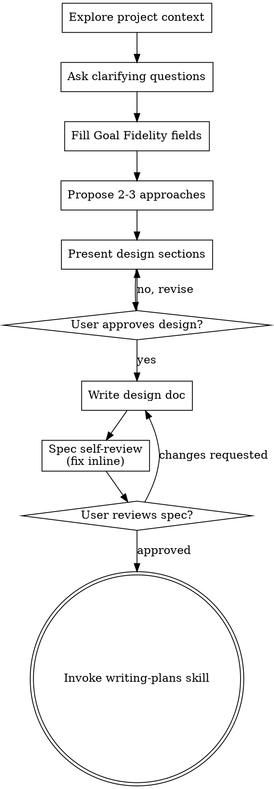

# Brainstorming Ideas Into Designs

Help turn ideas into fully formed designs and specs through natural collaborative dialogue.

Start by understanding the current project context, then ask questions one at a time to refine the idea. Once you understand what you're building, present the design and get user approval.

<HARD-GATE>
Do NOT invoke any implementation skill, write any code, scaffold any project, or take any implementation action until you have presented a design and the user has approved it. This applies to EVERY project regardless of perceived simplicity.
</HARD-GATE>

## Anti-Pattern: "This Is Too Simple To Need A Design"

Every project goes through this process. A todo list, a single-function utility, a config change — all of them. "Simple" projects are where unexamined assumptions cause the most wasted work. The design can be short (a few sentences for truly simple projects), but you MUST present it, get approval, write it down, and hand off to writing-plans.

The only change that skips this skill is the exactly-one-line mechanical exception defined in `using-superpowers`, and that exception is conjunctive — every one of its conditions must hold. There is no "small enough to implement directly from this conversation" path, no "bounded scope so we can skip the spec" path, and no "we already discussed it" path. Whatever the perceived size, the outcome of this skill is a written spec the user approved and a handoff to writing-plans.

## Checklist

You MUST create a task for each of these items and complete them in order:

1. **Explore project context** — check files, docs, recent commits; find the actual runtime and its production callers
2. **Offer the visual companion just-in-time** — NOT upfront. The first time a question would genuinely be clearer shown than described, offer it then (its own message); on approval its browser tab opens for you. If no visual question ever arises, never offer it. See the Visual Companion section below.
3. **Ask clarifying questions** — one at a time, understand purpose/constraints/success criteria
4. **Fill the Goal Fidelity design fields** — observable goal, authoritative runtime, before/after behavior, non-goals, forbidden substitutions, production caller evidence (see below)
5. **Propose 2-3 approaches** — meaningful alternatives, with trade-offs and your recommendation
6. **Present design** — in sections scaled to their complexity, get user approval after each section
7. **Write design doc** — save to `docs/superpowers/specs/YYYY-MM-DD-<topic>-design.md` and commit
8. **Spec self-review** — quick inline check for placeholders, contradictions, ambiguity, scope (see below)
9. **User reviews written spec** — ask user to review the spec file before proceeding
10. **Transition to implementation** — invoke writing-plans skill to create implementation plan

## Process Flow



**The terminal state is invoking writing-plans.** Do NOT invoke frontend-design, mcp-builder, or any other implementation skill. The ONLY skill you invoke after brainstorming is writing-plans.

## The Process

**Understanding the idea:**

- Check out the current project state first (files, docs, recent commits)
- Before asking detailed questions, assess scope: if the request describes multiple independent subsystems (e.g., "build a platform with chat, file storage, billing, and analytics"), flag this immediately. Don't spend questions refining details of a project that needs to be decomposed first.
- If the project is too large for a single spec, help the user decompose into sub-projects: what are the independent pieces, how do they relate, what order should they be built? Then brainstorm the first sub-project through the normal design flow. Each sub-project gets its own spec → plan → implementation cycle.
- For appropriately-scoped projects, ask questions one at a time to refine the idea
- Prefer multiple choice questions when possible, but open-ended is fine too
- Only one question per message - if a topic needs more exploration, break it into multiple questions
- Focus on understanding: purpose, constraints, success criteria

**Exploring approaches:**

- Propose 2-3 different approaches with trade-offs
- Present options conversationally with your recommendation and reasoning
- Lead with your recommended option and explain why
- YAGNI ruthlessly - remove unnecessary features from every approach and design

**Presenting the design:**

- Once you believe you understand what you're building, present the design
- Scale each section to its complexity: a few sentences if straightforward, up to 200-300 words if nuanced
- Ask after each section whether it looks right so far
- Cover: architecture, components, data flow, error handling, testing
- Be ready to go back and clarify if something doesn't make sense

**Design for isolation and clarity:**

- Break the system into smaller units that each have one clear purpose, communicate through well-defined interfaces, and can be understood and tested independently
- For each unit, you should be able to answer: what does it do, how do you use it, and what does it depend on?
- Can someone understand what a unit does without reading its internals? Can you change the internals without breaking consumers? If not, the boundaries need work.
- Smaller, well-bounded units are also easier for you to work with - you reason better about code you can hold in context at once, and your edits are more reliable when files are focused. When a file grows large, that's often a signal that it's doing too much.

**Working in existing codebases:**

- Explore the current structure before proposing changes. Follow existing patterns.
- Where existing code has problems that affect the work (e.g., a file that's grown too large, unclear boundaries, tangled responsibilities), include targeted improvements as part of the design - the way a good developer improves code they're working in.
- Don't propose unrelated refactoring. Stay focused on what serves the current goal.

## After the Design

**Documentation:**

- Write the validated design (spec) to `docs/superpowers/specs/YYYY-MM-DD-<topic>-design.md`
  - (User preferences for spec location override this default)
- Use elements-of-style:writing-clearly-and-concisely skill if available
- Commit the design document to git

**Spec Self-Review:**
After writing the spec document, look at it with fresh eyes:

1. **Placeholder scan:** Any "TBD", "TODO", incomplete sections, or vague requirements? Fix them.
2. **Internal consistency:** Do any sections contradict each other? Does the architecture match the feature descriptions?
3. **Scope check:** Is this focused enough for a single implementation plan, or does it need decomposition?
4. **Ambiguity check:** Could any requirement be interpreted two different ways? If so, pick one and make it explicit.

Fix any issues inline. No need to re-review — just fix and move on.

**User Review Gate:**
After the spec review loop passes, ask the user to review the written spec before proceeding:

> "Spec written and committed to `<path>`. Please review it and let me know if you want to make any changes before we start writing out the implementation plan."

Wait for the user's response. If they request changes, make them and re-run the spec review loop. Only proceed once the user approves.

**Implementation:**

- Invoke the writing-plans skill to create a detailed implementation plan
- Do NOT invoke any other skill. writing-plans is the next step.

## Visual Companion

A browser-based companion for showing mockups, diagrams, and visual options during brainstorming. Available as a tool — not a mode. Accepting the companion means it's available for questions that benefit from visual treatment; it does NOT mean every question goes through the browser.

**Offering the companion (just-in-time):** Do NOT offer it upfront. Wait until a question would genuinely be clearer shown than told — a real mockup / layout / diagram question, not merely a UI *topic*. The first time that happens, offer it then, as its own message:
> "This next part might be easier if I show you — I can put together mockups, diagrams, and comparisons in a browser tab as we go. It's still new and can be token-intensive. Want me to? I'll open it for you."

**This offer MUST be its own message.** Only the offer — no clarifying question, summary, or other content. Wait for the user's response. If they accept, start the server with `--open` so their browser opens to the first screen automatically. If they decline, continue text-only and don't offer again unless they raise it.

**Per-question decision:** Even after the user accepts, decide FOR EACH QUESTION whether to use the browser or the terminal. The test: **would the user understand this better by seeing it than reading it?**

- **Use the browser** for content that IS visual — mockups, wireframes, layout comparisons, architecture diagrams, side-by-side visual designs
- **Use the terminal** for content that is text — requirements questions, conceptual choices, tradeoff lists, A/B/C/D text options, scope decisions

A question about a UI topic is not automatically a visual question. "What does personality mean in this context?" is a conceptual question — use the terminal. "Which wizard layout works better?" is a visual question — use the browser.

If they agree to the companion, read the detailed guide before proceeding:
`skills/brainstorming/visual-companion.md`

---

## Hong policy extension

This section is a user policy overlay on top of the upstream skill. The skill name
and the design process above are unchanged.

### No bounded bypass

Design depth is not a budget to trade away. Do not shorten or skip this skill
because the change looks small, because the scope is already bounded, because the
user described the change precisely, or because time or tokens are tight.

The only change that reaches implementation without a written spec and a written
implementation plan is the exactly-one-line mechanical exception in
`using-superpowers`. If even one of its conditions is uncertain, the change comes
through here.

### Required design steps

Every run of this skill does all of the following, in order:

1. Inspect the actual context — files, docs, recent commits, and the real runtime.
2. Ask clarifying questions one at a time, where the answer would change the design.
3. Fill the Goal Fidelity design fields below with concrete values.
4. Propose 2-3 meaningful alternatives with trade-offs and a recommendation.
   Restating one approach three ways is not two-to-three approaches.
5. Present the design in sections and get approval section by section.
6. Write the spec document.
7. Run the spec self-review.
8. Have the user review the written spec.
9. Invoke writing-plans.

### Required design coverage

Beyond architecture, components, data flow, error handling, and testing, the
design must also cover:

- data, security, deployment, and physical boundaries
- failure behavior and rollback
- acceptance evidence — what proves this is done
- parallel ownership and integration order, if the work splits across workers
- risks, alternatives, and knowledge gaps the user has not raised

### Goal Fidelity design fields

Goal substitution is replacing the user's observable goal with a different
platform found in the repository, a deprecated historical plan, a migration, or
adjacent infrastructure work. It must be blocked in the design, not at the
approval gate where the work is already wasted.

Every spec states these as concrete values, never as placeholders:

```md
## Goal Fidelity

Observable goal:
- [the actual result the user will see]

Authoritative runtime:
- [the real surface and delivery path]

Production caller evidence:
- [user confirmation, production entry point/caller, running or deployed artifact]

Approved behavior delta:
- Before: [current observed behavior]
- After: [approved behavior]

Explicit non-goals:
- [deprecated platform or plan]
- [adjacent but unrequested capability]
- [candidate present in the repository but not the active runtime]

Forbidden substitutions:
- [migration, framework conversion, infrastructure replacement, and similar]
```

When sources conflict, resolve in this order: current direct user goal, then
user-approved current spec, then verified runtime and production caller, then the
current approved implementation plan, then project instructions, then historical
handoffs, plans, worktrees, and branch names, then dormant or deprecated
repository code. Lower-ranked sources may supply implementation evidence; they
never redefine the goal.

### Proposal duty

YAGNI removes unrequested implementation, not unrequested information.

- Do not silently fold an unrequested file, field, rule, or feature into the design.
- Do not hide a blind spot, risk, missing requirement, alternative, or improvement
  that the user needs in order to decide.
- Surface out-of-scope ideas explicitly and do not implement them without approval:

```text
Non-executing proposal:
Why it matters:
Trade-offs:
Reversibility:
Smallest next step:
Implementation performed: no
```

An approved proposal enters the spec through the normal design flow. Until then it
stays out of the spec, out of the plan, and out of the implementation scope.
